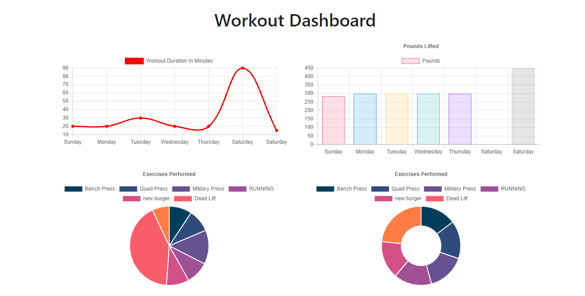

# Workout-Tracker

## Description
This application can create and track a users workout routine and dynamicly display the information in separate charts based on different cardio and resistance exercises. The user's workout information are stored in a no-sql mongo database using a mongoose schema.

## Table of Contents
* [Usage](#Usage)
* [Demonstration](#Demonstration)
* [License](#License)
* [Questions](#Questions)

## Usage
On the Homepage there are two options for the user, a new workout button that will ask the user to create a fresh workout that doesnt have any exercises yet, or a continue workout button that will add on more exercises to the most current workout plan the user has created. Users may also navigate to the stats page by clicking the dashboard button in the nav-bar and get a view of the charts displaying information on their last 7 workouts.

### Deployed application link - https://nameless-inlet-68704.herokuapp.com/

## Demonstration

## License
MIT License - Copyright 2021 Patrick-Kaczmar

    Permission is hereby granted, free of charge, to any person obtaining a copy of this software and associated documentation files (the "Software"), to deal in the Software without restriction, including without limitation the rights to use, copy, modify, merge, publish, distribute, sublicense, and/or sell copies of the Software, and to permit persons to whom the Software is furnished to do so, subject to the following conditions:
    
    The above copyright notice and this permission notice shall be included in all copies or substantial portions of the Software.
    
    THE SOFTWARE IS PROVIDED "AS IS", WITHOUT WARRANTY OF ANY KIND, EXPRESS OR IMPLIED, INCLUDING BUT NOT LIMITED TO THE WARRANTIES OF MERCHANTABILITY, FITNESS FOR A PARTICULAR PURPOSE AND NONINFRINGEMENT. IN NO EVENT SHALL THE AUTHORS OR COPYRIGHT HOLDERS BE LIABLE FOR ANY CLAIM, DAMAGES OR OTHER LIABILITY, WHETHER IN AN ACTION OF CONTRACT, TORT OR OTHERWISE, ARISING FROM, OUT OF OR IN CONNECTION WITH THE SOFTWARE OR THE USE OR OTHER DEALINGS IN THE SOFTWARE.

## Questions
Patrick-Kaczmar's GitHub profile - https://github.com/Patrick-Kaczmar

If there are any additional questions about this repository please contact me at pk1blue@yahoo.com
